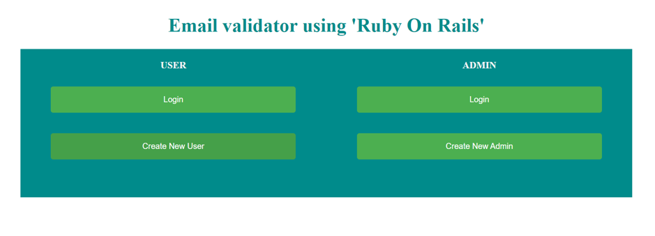
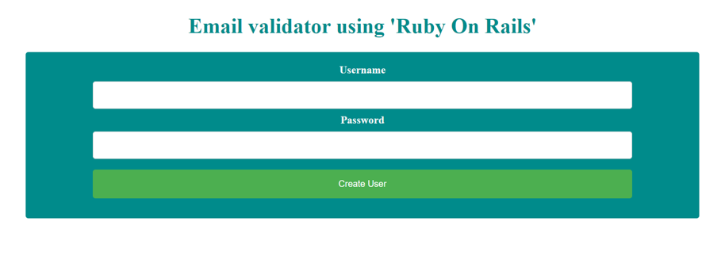
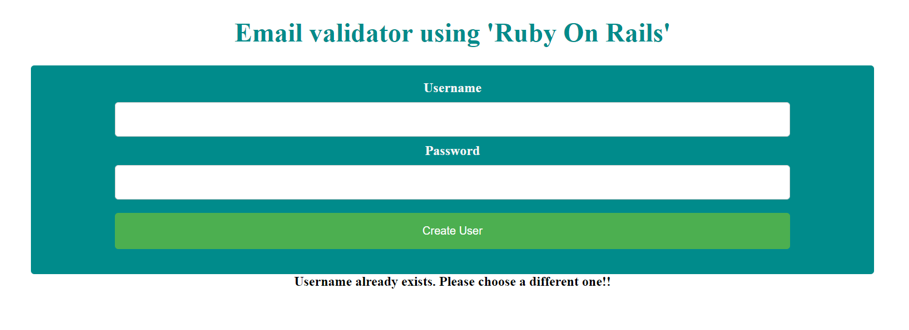
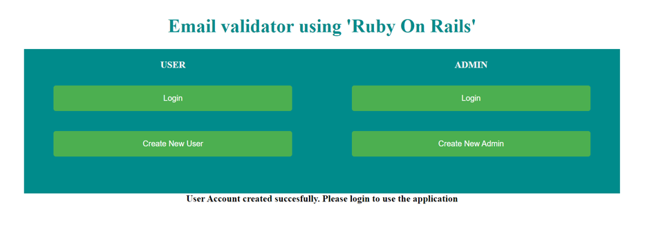
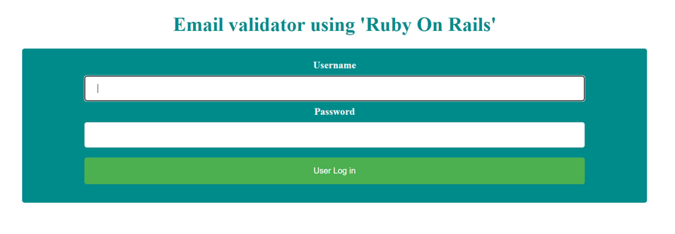
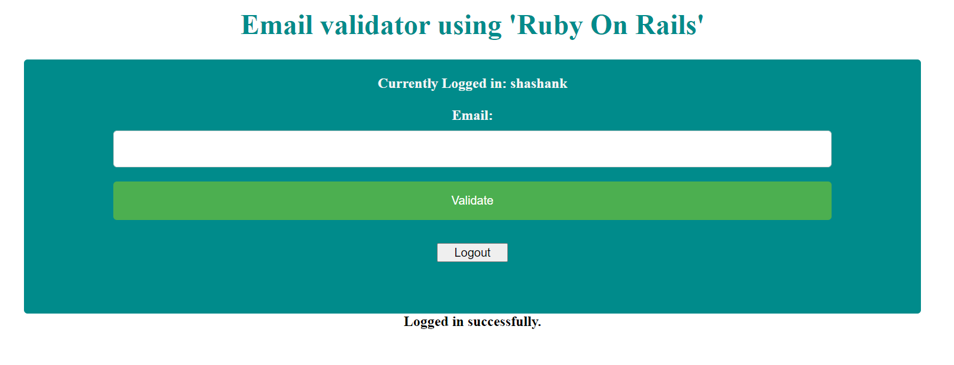
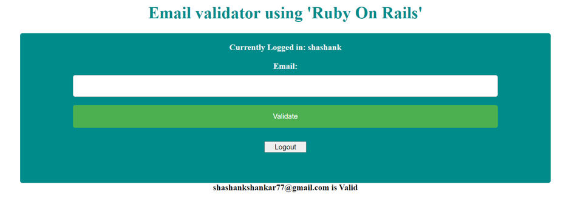
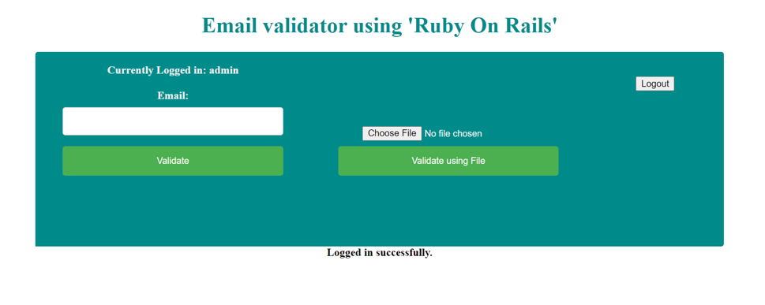
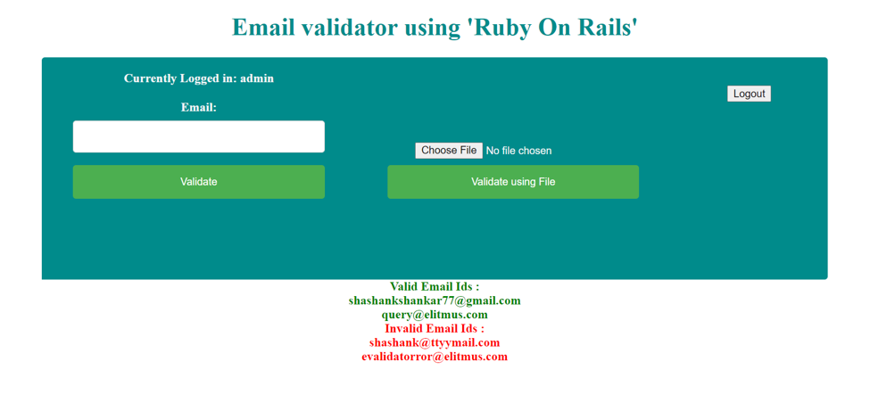

# README

<b>This tool validates that provided email Id/Ids is/are valid or not.</b>

<b>Note</b> : I am using Truemail gem for the main functionality of email Id validation. I have set Validation type to smtp, for most accuracy ,in Truemail configuration, that means first it will do Regex Validation (Validating it against) then mx validation (searching for email server for the domain in the given email Id) and then finally smtp validation (checks the real existence of email account on a current email server).

<b>I have deployed it on Heroku . You can use it on the below link.</b> 
<big>https://emailvalidatorror.herokuapp.com/</big>
   
<b>Part 1 of this Readme file has Steps to use the Tool on this link directly or after installation to the local machine. 
Part 2(bottom part) has the information about the installation to the local machine. 
Note :</b> I have given Create New Admin option also for now, may take it out later.

<b>Part One : 
Steps to use the tool:</b> 
•	This is the index page which you will see on the given link.

•	Click on Create New User button if you want to use it as a user. Below Screen will appear.

•	Provide a username and a password and click on create user to create your account. You have to choose a unique username. If you use a username which is already taken, you will see the below screen which say “Username already exists. Please chose a different one”.

•	If everything goes fine, then you account will be created, and you will be redirected to the index page again displaying a message to log in and use the app.

•	Similarly, admin can also be created using Create new Admin button.
•	Now you need to click on Login button to below the test USER. You will get the below screen.

•	Provide correct username and password and click on User Log In.   In case of wrong credentials, we won’t be able to login and get the below page.

•	If everything goes right, then we will be logged in to the tool. This will show you username at   the top.

•	In the email box, we will enter any email id and click on Validate. Then at the bottom of the block, it will show us that email Id is valid or not.

•	Click on Logout button to end the session as the current user.
•	Same way we can enter the tool as admin also.
But Admin has one more feature of bulk Validation along with this feature of single Validation.

•	For bulk Validation, click on Choose File button and select a CSV file containing multiple Email IDs separated by comma only and click on Validate using File. You will get list of valid and invalid IDs at the bottom of the block as shown. For example, I used a file having 4 email IDs , two of them are valid and two are invalid as shown in the below screenshot.

<b>Note : </b> Also I have uploaded this sample csv file in <b>readmeimages</b> folder in the repository to give clear picture of file format. Name of the file is <b>test.csv</b> .
Also, for the admin access, you can create new admin as option exists there currently or you can use 
one already created by me : [ username = 'admin' and password = 'admin'] if you are using the heroku deployed app using the given link. If you are going to use it in your local machine (steps described in the next part), then there won't be any existing records. You will need to create new credentials only.

<b>Part two : </b>
<b>How to use this tool on your local machine.</b>
Note : I am using windows and Git bash terminal for the installation and starting the server.  
•	First You need to clone this repository in your system

     $ git clone  https://github.com/why-shashank/EmailValidatorROR.git

•	Then go to the app directory

     $ cd EmailValidatorROR

•	Then install the needed gems except the gem in production (as I have put PostgreSQL gem for production because I wanted to deploy it on heroku while I used SQLite for development)

      $ bundle install –without production

•	Install Javascript dependencies

      $ yarn install

•	Migrate the database

      $ rails db:migrate

•	Start the server 

      $ rails s

•	Open browser and type ‘localhost:3000’ in URL and press enter, You will see the index page if everything goes fine and You can start using the application as described in part 1 of this document.
        

Note: I am very new to Ruby on rails, like I have started this project without knowing ruby or rails, I have gone through many available resources while learning it and developed this in a short time, so there can be mistakes or things which could be done in a better way. Any constructive comment or remark will be very helpful. Thank you.

